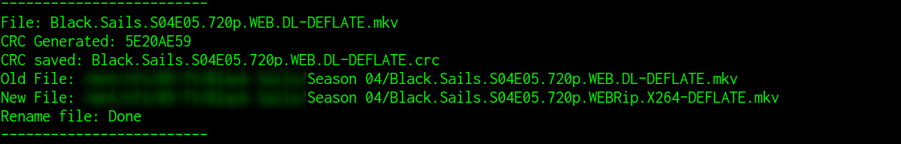

# releasename_match
Match local filename with extenstion .mkv with external srrdb. If there is a match this script will rename the file.

# Requirements
```
apt-get install cksfv
```

# Arrguments
```
-p or --path  Directory location.
--check-only  This wil check if there is any match
```

# Example  
```
python3.7 ./releasename-check.py -p /Path/To/Folder
```



if someone have another website like srrdb with api and crc searchs support let me know.

**Use this for your own risk**\
**Still under construction**

